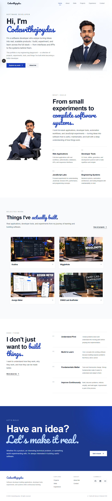

# Ajoy Das — Developer Portfolio

> A personal portfolio showcasing my software projects, engineering experiments, developer tools, technical journey, and the way I approach building software.



## Overview

This repository contains the source code for my personal developer portfolio.

The portfolio is designed to be more than a collection of links. It documents the things I have built, the technologies I work with, the engineering problems I explore, and the process behind my projects.

Rather than focusing heavily on visual effects, the portfolio focuses on:

- Real projects
- Engineering experiments
- Developer tools
- Technical learning
- Problem-solving
- Clean interfaces
- Practical software development

The goal is simple:

> **Build software, understand how it works, and document the journey.**

---

## Live Portfolio

**Website:**  
https://codewithajoydas.live

---

## What You'll Find

### Selected Work

A collection of applications, developer tools, experiments, and other software projects that I have built.

Each project can include:

- Project overview
- Problem being solved
- Features
- Technology stack
- Screenshots
- GitHub repository
- Live application
- Engineering decisions
- Challenges and solutions

### Engineering Journey

A timeline of the technologies, concepts, and engineering areas I have explored while developing software.

### Engineering Lab

A collection of smaller experiments and technical explorations.

Examples include:

- JavaScript experiments
- Node.js experiments
- Developer utilities
- CLI tools
- Performance experiments
- Programming language experiments
- Web platform experiments

### How I Think

A look into the principles I follow while building software.

Some of the principles include:

- Understand the problem first
- Build to learn
- Understand fundamentals
- Keep improving
- Prefer practical solutions
- Learn from implementation problems

### Currently Building

Projects and experiments that are actively being developed.

---

# Tech Stack

The portfolio is built using modern web technologies.

## Frontend

- Next.js
- React
- TypeScript
- Tailwind CSS
- HTML
- CSS
- JavaScript

## UI & Design

- Responsive design
- Component-based architecture
- Custom typography
- Lucide Icons
- CSS animations
- Accessible UI patterns

## Content & Project Data

- TypeScript / JSON-based project data
- GitHub API
- Dynamic project routes
- Markdown / MDX where appropriate

## Development

- ESLint
- Prettier
- Git
- GitHub
- npm

## Deployment

- Vercel

---

# Project Architecture

The portfolio follows a component-oriented Next.js architecture.

```text
portfolio/
│
├── app/
│   ├── page.tsx
│   ├── about/
│   ├── projects/
│   │   └── [slug]/
│   ├── skills/
│   ├── experience/
│   ├── contact/
│   └── ...
│
├── components/
│   ├── Header/
│   ├── Footer/
│   ├── Hero/
│   ├── Projects/
│   ├── About/
│   ├── Skills/
│   └── ...
│
├── data/
│   └── projects/
│
├── public/
│   ├── images/
│   ├── projects/
│   └── ...
│
├── lib/
│   └── ...
│
├── store/
│   └── ...
│
├── styles/
│   └── ...
│
├── package.json
├── tsconfig.json
├── next.config.ts
├── eslint.config.mjs
└── README.md